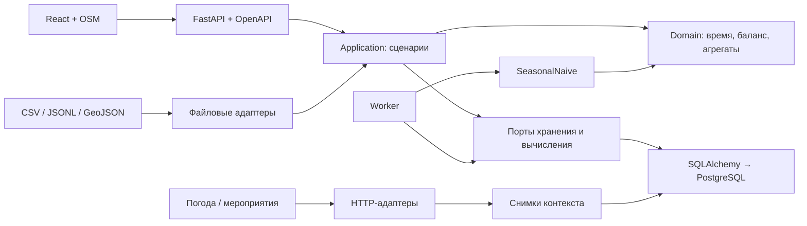

# Архитектура и поток данных

Приложение состоит из HTTP API, независимого worker, PostgreSQL, библиотеки ML без обучения и React-клиента. Один процесс не обязан запускать остальные. Сборка frontend также может раздаваться API с одного origin.

## Границы

| Компонент | Ответственность | Зависимости |
|---|---|---|
| `backend/src/tram/domain` | Время, пространственные ключи, сохранение пассажирской массы, взвешивание, сценарный выпуск | Стандартная библиотека |
| `backend/src/tram/application` | Публикация, чтение, очередь, рейсы, снимки, оценка и экспорт | Domain, протоколы портов; без HTTP/SQL/ML-реализаций |
| `backend/src/tram/infrastructure` | PostgreSQL, файлы, внешние HTTP API, конфигурация и контракт | Внешние библиотеки; реализует порты |
| `backend/src/tram/api` | Авторизация, HTTP, JSON Schema, ответы, привязка операций | Сценарии приложения; простой калькулятор вызывает чистую domain-функцию |
| `backend/src/tram/composition.py` | Создание и соединение всех компонентов | Единственная точка сборки сервисов |
| `ml/src/tram_ml` | Сезонная база, календарные/внешние признаки, временные folds, MAE/WAPE | Только domain и стандартная библиотека |
| `frontend/src` | Состояние интерфейса, клиент API, карта, графики и формы | Без прямого SQL и ключей поставщиков |

Зависимости domain/application/ML проверяются AST-тестами. Внешние библиотеки не протекают в предметные расчёты. Структуры JSON применяются на границах; ключевые инварианты времени и рядов дополнительно проверяют domain-типы.

## Версии и время

- `dataset_revision_id` фиксирует набор наблюдений и возможностей. `network_revision_id` фиксирует сеть и порядок остановок. Повторная публикация разрешена только для идентичного содержимого; исправление получает новую версию.
- `run_id` связывает карту, график, метод, профиль, период и `as_of`. Результат расчёта публикуется целиком одной транзакцией.
- `event_time`/границы интервала описывают событие. `available_at` — когда данные стали доступны. Предиктор видит только завершённые наблюдения с `available_at <= as_of`.
- Входное время — RFC3339 со смещением; хранение нормализуется в UTC, календарные границы и интерфейс — Москва. Интервалы полуоткрытые `[start,end)`.
- `source_mode=demo` описывает синтетическое происхождение. `value_kind=estimated` описывает восстановленное значение. Эти признаки независимы: синтетический пример также может изображать наблюдения.

## Очередь и конкурентность

`POST /forecast-runs` требует ключ идемпотентности; повтор возвращает исходный запуск, другое содержимое с тем же ключом — 409. Worker забирает задание через `FOR UPDATE SKIP LOCKED`, получает lease и уникальный fencing token. Просроченное задание можно забрать повторно; старый worker не может записать результат нового владельца. API не выполняет ML внутри GET.

Публикация набора и события рейса защищены PostgreSQL advisory locks. Событие и состояние после него записываются одной транзакцией. SQLite используется только в тестах и изолированном browser smoke; гарантии промышленной конкурентности проверяются на PostgreSQL.

## Наполненность

Каждая посадка создаёт группу с распределением возможных остановок выхода. Остаток переносится через события. Применяются `short`, `uniform`, `long`; время поездки ограничено следующей остановкой и конечной. Равномерность по времени распределяется на ближайшие плановые остановки через середины интервалов. Задержка не вызывает высадки между остановками и не меняет распределение без нового плана.

Измеренные суммарные высадки корректируют оставшуюся массу пропорционально, но не идентифицируют людей. В конце обязательна полная высадка. Кольцевой рейс должен быть развёрнут в опубликованную последовательность посещений с явной конечной; непрерывное кольцо без сброса не поддерживается.

`export-occupancy` усредняет остатки по длительности завершённых проездов на каждом участке. Для ratio сначала делит остаток на вместимость данного вагона, затем усредняет. Нет проезда — нет значения. Покрытие всей транспортной сети неизвестно, поэтому coverage_ratio не выдумывается. Новые агрегаты доступны только с момента экспорта.

## Контекст и оценка

Каждый внешний запрос создаёт новый неизменяемый снимок, включая неудачные запросы. HTTP-адаптеры используют фиксированные адреса, таймауты и ограничения размера; ключи не сохраняются в снимках. `context_features` выбирает последнюю успешную версию, уже известную на `as_of`, и делает пространственно-временное сопоставление. Сейчас сезонная база эти признаки не использует.

`evaluate` строит полные горизонты на заданных отсечках, сравнивает прогноз с фактами, доступными к созданию отчёта, сохраняет отчёт и точки атомарно. MAE/WAPE рассчитываются на сопоставимых непустых парах. Пустая выборка и нулевая сумма фактов дают объяснённый `null`. Обученной модели и регрессии нет: `model` совпадает с `seasonal_naive`, `regression=null`.

## Расширение

Для нового источника реализовать `ContextProvider` или отдельный ETL-адаптер, сохранив происхождение и временную доступность. Для обученной модели реализовать `Predictor`, версионировать артефакт, признаки и cutoff, расширить проверку поддерживаемого метода и провести независимый backtesting. Контракт меняется одновременно с обработчиком и тестом ответа. Не добавлять неработающие операции в Swagger.
